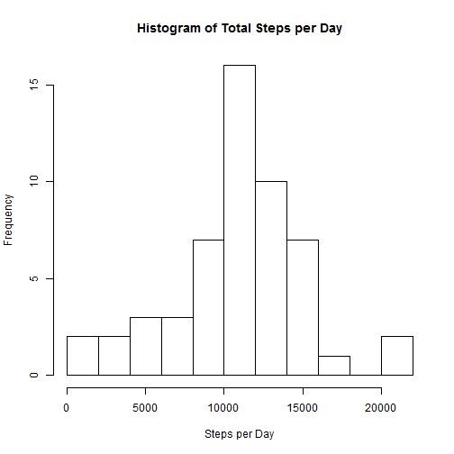
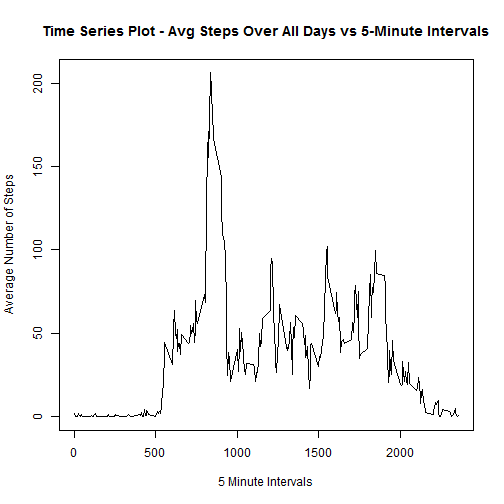
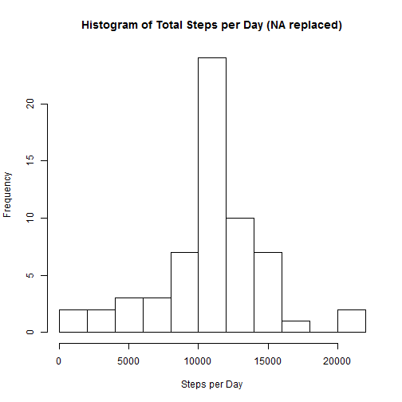
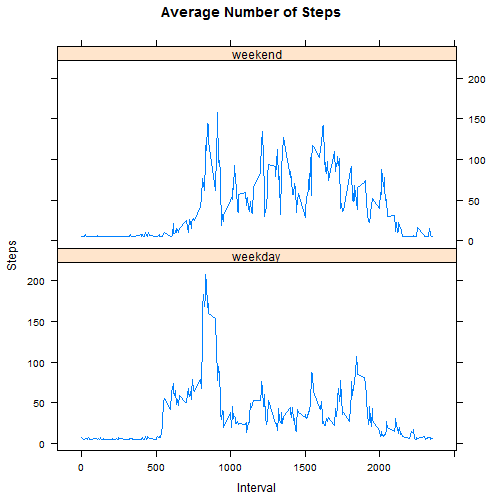

This is a report that will answer the questions that are posed in the instructions of assignment #1. All questions, answers and associated R code are contained in this R Markdown document. Note that the main question is restated and the answer given at the end of each section.

##Set Global Options

```r
library(knitr)
##
## Removed scientific notation in document and use 2 decimal places for values being displayed in this R Markdown doc.
##
options(scipen=999, digits=2)
##
## Always display code in doc
##
opts_chunk$set(echo = TRUE) 
```

##Loading and preprocessing data
Following is code for unzipping and reading the activity dataset.  There is no preprocessing to be done at this time. 

```r
##
## File expected in working directory, unzipped and read into a df
##
unzip("activity.zip")
activity.Data <- read.csv("activity.csv", header=TRUE)
```
About the data: This assignment makes use of data from a personal activity monitoring device. This device collects data at 5 minute intervals through out the day. The data consists of two months of data from an anonymous individual collected during the months of October and November, 2012 and include the number of steps taken in 5 minute intervals each day.  
The variables included in this dataset are:  
- steps: Number of steps taking in a 5-minute interval (missing values are coded as NA)  
- date: The date on which the measurement was taken in YYYY-MM-DD format  
- interval: Identifier for the 5-minute interval in which measurement was taken   
The dataset is stored in a comma-separated-value (CSV) file and there are a total of 17,568 observations in this dataset.

##What is mean number total steps per day?

Note: we are ignoring the missing values in the dataset at this time.

1. Here we calculate the total number of steps taken per day by summing up the steps per interval for each day in the dataset.


```r
##
##  Summation into new df
##
activity.Sum <- aggregate(activity.Data$steps, by=list(activity.Data$date), FUN=sum)
##
##  Replace names in df
##
names(activity.Sum) <- list('date', 'steps')
```

2. The following is the R code and actual histogram of the total number of steps taken each day.  The histogram shows the frequency (y axis) that each total that occurs in the summary of steps by day (x axis).  

```r
##
##  This renders a 'HISTOGRAM' as requested in instructions
##
hist(activity.Sum$steps, breaks=10, xlab='Steps per Day', main='Histogram of Total Steps per Day')
```

 

3. The following code calculates the mean and median of the total number of steps taken per day.


```r
##
##  calculate mean steps and assign to variable to display in doc.
##  Ignore missing variables.
##
mean.Steps <- mean(activity.Sum$steps, na.rm=TRUE)
```
The mean of the total number of steps per day is 10766.19.

```r
##
##  calculate median steps and assign to variable to display in doc.
##  Ignore missing variables.
##
median.Steps <- median(activity.Sum$steps, na.rm=TRUE)
```
The median of the total number of steps per day is 10765.  

**What is mean number total steps per day? Answer: 10766.19**

##What is the average daily activity pattern?

1. Below is the code and a the rendering of the time series plot for the 5 minute interval (x-axis) and the average number of steps taken, averaged across all days(y-axis).


```r
##
## summarize mean into new df
##
activity.Mean <- aggregate(steps ~ interval, activity.Data, FUN=mean)
##
## Plot time series using base function 'plot'
##
plot(activity.Mean$interval, activity.Mean$steps, type='l', xlab='5 Minute Intervals', ylab='Average Number of Steps', main='Time Series Plot - Avg Steps Over All Days vs 5-Minute Intervals')
```

 


```r
##
##  Calulate max interval and assign to variable for display in doc
##
maxsteps <- activity.Mean$interval[which.max(activity.Mean$steps)]
```
**2.  The 5-minute interval, on average, across all the days in the dataset that contains the maximum number of steps is: 835.**

**What is the average daily activity pattern? Answer: The above time series plot provides a visual display of the average daily activity pattern.**

##Imputed missing values

1. Following is the R code to determine the total number of missing values in the dataset is calculated.


```r
##
## Calc total missing values in dataset and assign to variable for
## display in doc
##
total.Na <- sum(is.na(activity.Data))
```
The total number of missing values in the dataset is: 2304

**2. The strategy that will be used to replace the missing values is to calculate the mean steps for the day and use that value to replace the missing values - NAs in the dataset. If a full day has no values then the average steps for the all days will replace the NA in this situation**

3. The following will create a new copy of the dataset and populate the NAs with the daily average number of steps. 


```r
##
## Create new dataset to replace NAs
##
activity.Data1 <- activity.Data
#
## Here we calculate the mean for each day
##
steps.Mean <- aggregate(steps ~ date, activity.Data, FUN=mean)
##
##  Now we replace each NA with the mean for that day. If a day has 
##  no data the mean for all days will be used.
##
alldays.Mean <- mean(activity.Data$steps, na.rm=TRUE)
for (i in 1:nrow(activity.Data1))  {
  current.Record <- activity.Data1[i,]
  if (is.na(current.Record$steps)) {
      if (as.Date(current.Record$date) %in% as.Date(steps.Mean$date))
         activity.Data1[i,]$steps <- subset(steps.Mean, 
               as.Date(steps.Mean$date) == 
               as.Date(current.Record$date))$steps
      else
         activity.Data1[i,]$steps <- alldays.Mean
   }                                    
}
```
4.  Below is the code and the histogram for the total number of steps taken each day followed by calculating the mean and median total number of steps taken per day.

```r
##
## Get the daily means using the new dataset
##
activity.Sum <- aggregate(activity.Data1$steps, by=list(activity.Data$date), FUN=sum)
names(activity.Sum) <- list('date', 'steps')
##
## Generate histogram
##
hist(activity.Sum$steps, breaks=10, xlab='Steps per Day', main='Histogram of Total Steps per Day (NA replaced)')
```

 


The following code calculates the mean and median of the total number of steps taken per day.


```r
##
## Calculate mean and create variable to be used to display result.
##
mean.Steps <- mean(activity.Sum$steps, na.rm=TRUE)
```
The mean of the total number of steps per day is 10766.19 (NA replaced with values).

```r
##
## Calculate median and create variabel to be used to display result.
##
median.Steps <- median(activity.Sum$steps, na.rm=TRUE)
```
The median of the total number of steps per day is 10766.19 (NA replaced with values). 

The impact of inputting missing data on the estimates of the total daily number of steps does change the histogram in that the outer areas of the distribution have less frequent occurances.  What was unexpected is that the mean stayed the same and that the median is now the same value if the mean, though they were close in the calculation where variables were missing. 

##Are there differences in activity between weeksdays and weekends?

1. Following is code to add a new factor variable to the the activity dataset with no missing variables.  The factor has two levels "weekday" and "weekend".


```r
##
## Put day of week in new column of df
##
activity.Data1$weekdiv <- weekdays(as.Date(activity.Data1$date))
##
## If day of week is a Sat or Sun replace value with weekend 
## otherwise replace with weekday.
##
for (i in 1:nrow(activity.Data1))  {
  if ((activity.Data1$weekdiv[i]) %in% c("Saturday", "Sunday"))
      activity.Data1$weekdiv[i] <- "weekend"
  else
      activity.Data1$weekdiv[i] <- "weekday"
}
```

2. Below is the code and the panel plot rendering containing a time series of the 5- minute intervals on the x axis and the average number of steps taken,averaged acrosss all the weekday days or weekend days on the y axis.


```r
library(lattice)
##
##  Create df with mean showing weekdiv (weekday or weekend)
##
activity.Mean <- aggregate(steps ~ weekdiv + interval, activity.Data1, FUN=mean)
##
## Panel plot using xyplot to render results
##
xyplot(data =activity.Mean, steps ~ interval | weekdiv, type ='l',  xlab = "Interval", ylab = "Steps",
             main="Average Number of Steps", layout=c(1,2))
```

 

**Are there differences in activity patterns between weekdays and weekends?  Answer:  Yes there are differences and they can be seen in the above plot.  Note that overall more steps are taken during the weekend period and that the activity also increases at a later time interval on the weekend.**

** This concludes the report for reproducible research peer assessment 1 - I hope you enjoyed reading it as much as I enjoyed the many hours putting it together - Thank You Howard**
